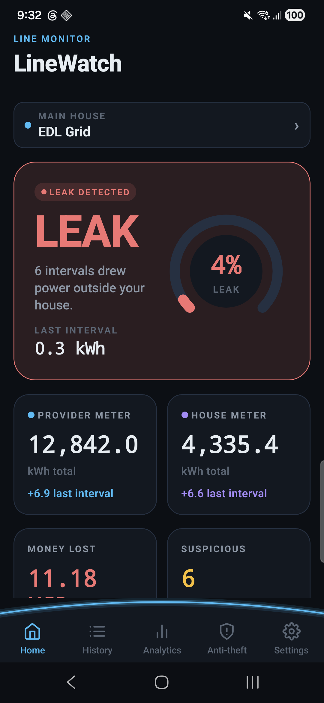
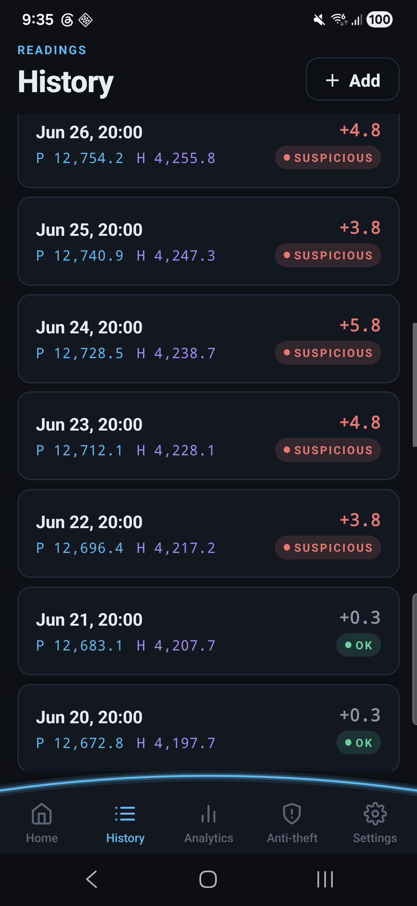
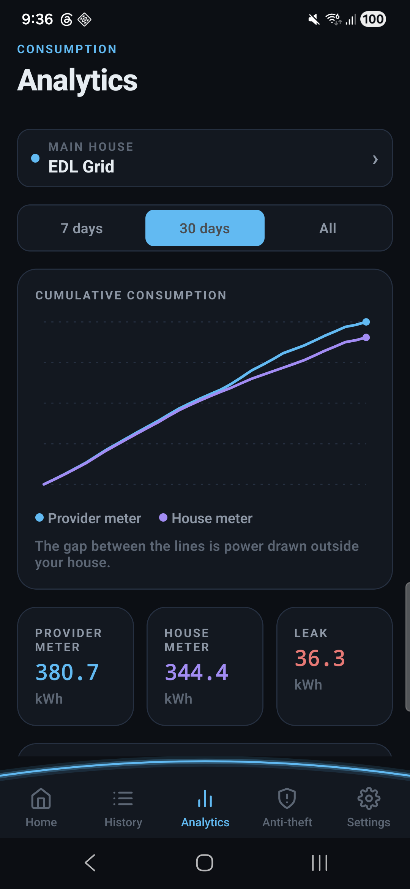
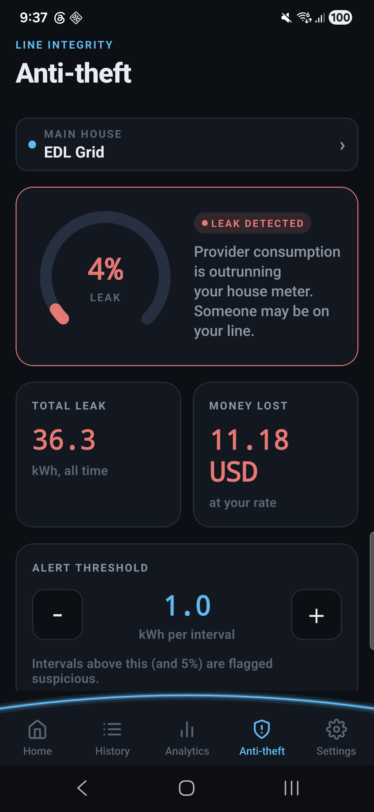
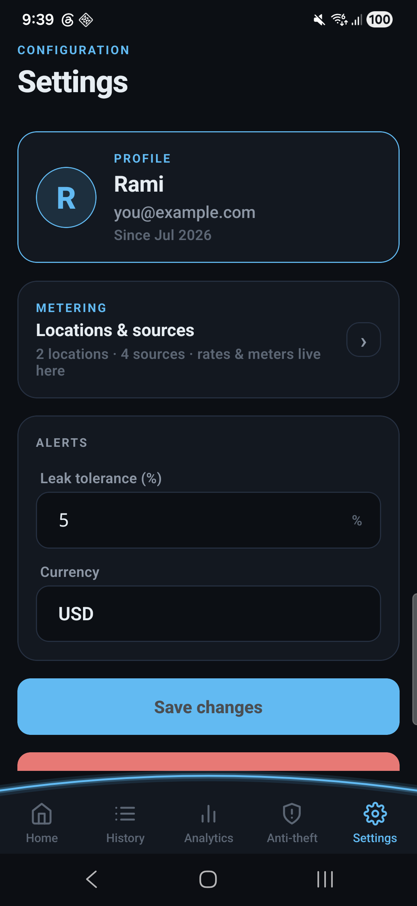
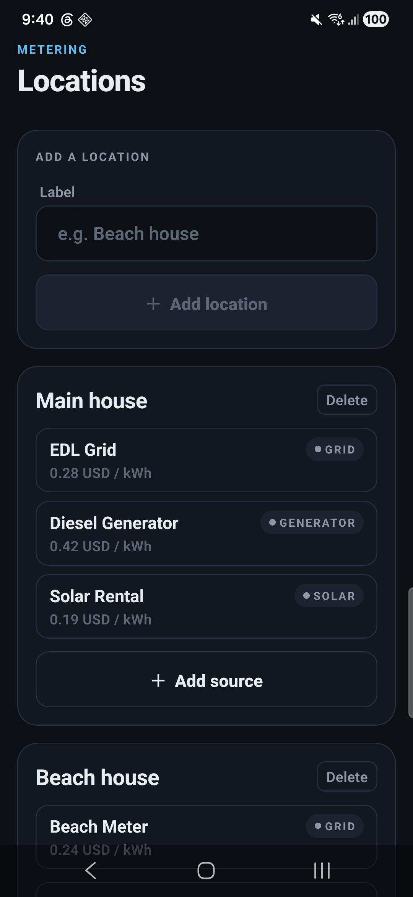
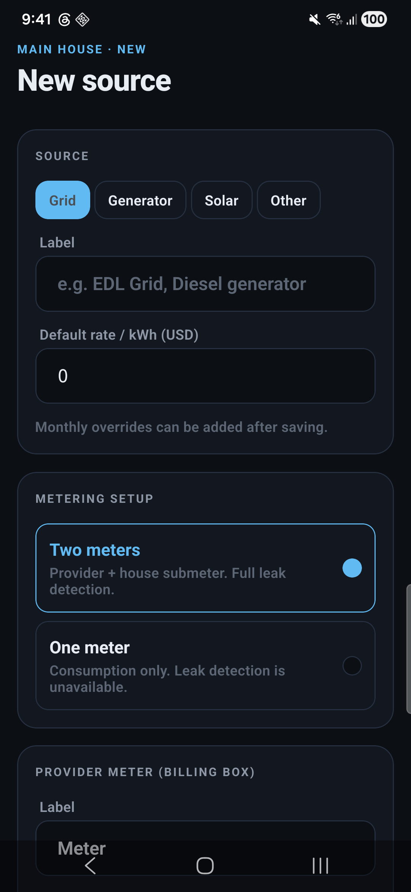

# LineWatch

**LineWatch** is a manual electric-meter tracker for people who share a line with an electricity provider (private generator, grid, solar-rental, etc.) and are billed per kWh at the **provider's meter** while their house has its own **submeter** on the same line.

If the provider meter is ticking faster than the house submeter, someone is drawing power outside the house — a tap on the line, a wiring fault, or plain theft. LineWatch surfaces that gap.

You can also run **single-meter** sources (no submeter, no leak detection — just consumption tracking), and manage **multiple houses** each with **multiple sources** (grid, generator, solar, other) at their own per-kWh rate.

---

## Screenshots

<table>
  <tr>
    <td align="center"></td>
    <td align="center"></td>
    <td align="center"></td>
  </tr>
  <tr>
    <td align="center">Home — leak status</td>
    <td align="center">History — suspicious intervals</td>
    <td align="center">Analytics</td>
  </tr>
  <tr>
    <td align="center"></td>
    <td align="center"></td>
    <td align="center"></td>
  </tr>
  <tr>
    <td align="center">Anti-theft</td>
    <td align="center">Settings</td>
    <td align="center">Locations &amp; sources</td>
  </tr>
  <tr>
    <td align="center"></td>
    <td align="center"></td>
    <td align="center"></td>
  </tr>
  <tr>
    <td align="center">Source editor — mode, rate, meters</td>
    <td align="center"></td>
    <td align="center"></td>
  </tr>
</table>

---

## Concept

### The core insight

You are billed at the **provider meter** (private-generator billing box or grid meter). Your **house submeter** counts only what your house actually consumed. In a healthy line:

```
provider consumption ≈ house consumption   (+ a small line loss)
```

If the provider counted **materially more** than the house between two readings, the gap is power drawn on the line but not inside the house. LineWatch calls that a **leak** and flags it.

### Two-meter mode (`pair`)

- Two meters per source: `providerMeter` (billing box) + `houseMeter` (submeter).
- **Leak = providerΔ − houseΔ** per interval.
- Alert when the leak exceeds both the absolute (`kWh`) and percentage tolerances.
- **Money lost** = leak × the rate for that month.

### One-meter mode (`single`)

- One meter per source. Just consumption tracking, no leak concept.
- The Anti-theft screen is **locked** for this source with a message pointing at the source editor to add a submeter.
- Home / Analytics show consumption-only variants (single-line chart, no leak tiles).

### Multi-house, multi-source

- **Location** groups sources (a house, a shop, a rental).
- **Source** is one billed line (Grid / Generator / Solar / Other) with its own rate, monthly-rate overrides, and meters.
- The whole app scopes to **one selected source at a time**. A header chip on every screen opens a picker to switch context.

---

## Features

- Manual reading entry with live leak preview
- Per-source default rate + per-month rate overrides
- Interval computation, leak detection, money-lost tracking
- History with a per-reading suspicion chip
- Analytics: cumulative dual/single-line chart + per-interval leak/consumption bars
- Locations & sources CRUD, source picker
- Offline mode: encrypted MMKV store, seedable
- Online mode: Firebase Auth + Firebase Realtime Database (per-user tree)
- Deterministic v1 → v2 data migration for existing installs

---

## Tech stack

- **Runtime**: Expo SDK 57, React Native 0.86, React 19, TypeScript (strict)
- **Nav**: React Navigation 7 (native-stack + bottom-tabs)
- **State**: Zustand 5 (realtime slice + UI slice)
- **DI**: TSyringe 4 (constructor injection via reflect-metadata)
- **Storage**:
  - offline → `react-native-mmkv` v4, AES-encrypted key at rest in `expo-secure-store`
  - online → `@react-native-firebase/database` (Realtime Database) + `@react-native-firebase/auth`
- **UI**: hand-built design system + `react-native-svg` charts
- **Build**: Expo Prebuild + Gradle (open-source path) or EAS Build (paid path)

Architecture is **Clean-Architecture-flavoured, feature-first**:

```
src/
├── app/          bootstrap, DI container wiring, navigation
├── core/         shared domain: model, services, state, data, repositories
├── shared/       formatters, hooks, id helpers
├── design-system/ tokens + components + charts
└── features/
    ├── auth/           full vertical slice
    ├── dashboard/      Home
    ├── readings/       Add / History / Detail
    ├── analytics/
    ├── leak/           Anti-theft (locked for single-meter)
    ├── locations/      Locations + SourceEditor + SourcePicker
    └── settings/
```

Import rule: `app → features → {design-system, core} → shared`. Features never import each other.

---

## Prerequisites

- **Node.js 20 LTS** (18 works too)
- **Java 17** (for local Android builds via Gradle)
- **Xcode 15+** (for iOS; macOS only)
- **Android Studio** with an emulator or a device in USB debug mode
- A **Firebase project** (see below)

Optional:
- `eas-cli` if you plan to use Expo Application Services

---

## Getting the code

```bash
git clone https://github.com/<you>/react-native-sample.git
cd react-native-sample          # this repo is the app root
npm ci
```

---

## Firebase setup

LineWatch uses Firebase Authentication (email/password) and Firebase Realtime Database. Nothing about it is server-side — the app talks to Firebase directly, and RTDB rules keep users scoped to their own subtree.

### 1. Create the project

1. Go to <https://console.firebase.google.com/> → **Add project**.
2. Skip Google Analytics (not used).
3. In **Build → Authentication → Sign-in method**, enable **Email/Password**.
4. In **Build → Realtime Database → Create Database**, pick a region (Frankfurt / Singapore / etc.) and start in **Locked mode** — we'll ship rules below.
5. Copy the RTDB URL from the top of the Data tab. It looks like `https://<project>-default-rtdb.firebaseio.com`.

### 2. Register the app(s)

- **Android**: **Project Settings → Add app → Android**. Package name **must be** `com.linewatch.app` (or change it consistently in `app.json`, the ProGuard rule, and your Firebase config). Download `google-services.json`.
- **iOS**: same, bundle id `com.linewatch.app`. Download `GoogleService-Info.plist`.

Place the downloaded files under **`firebase/`**:

```
firebase/
├── GoogleService-Info.plist          ← ignored by git
├── database.rules.json               ← committed
├── firebase.json                     ← committed
├── google-services.json              ← ignored by git
├── google-services.json.example      ← committed (template)
└── GoogleService-Info.plist.example  ← committed (template)
```

### 3. Deploy the Realtime Database rules

The repo ships strict per-user rules in [`firebase/database.rules.json`](firebase/database.rules.json):

```jsonc
{
  "rules": {
    "users": {
      "$uid": {
        ".read":  "auth != null && auth.uid === $uid",
        ".write": "auth != null && auth.uid === $uid"
      }
    }
  }
}
```

Deploy them with the Firebase CLI:

```bash
npm i -g firebase-tools
firebase login
firebase use <your-project-id>
firebase deploy --only database --config firebase/firebase.json
```

Or paste the same JSON into **Realtime Database → Rules** in the console.

**Why these rules matter.** LineWatch stores everything under `users/{uid}/…` (schemaVersion, profile, settings, locations, sources, readings). With the rules above, one signed-in user can never read or write another user's tree.

### 4. Configure the RTDB URL

The URL is not embedded in `google-services.json` (Firebase downloads that before the DB region is chosen). Set it via environment:

```bash
cp .env.example .env
# then edit .env:
# EXPO_PUBLIC_FIREBASE_DATABASE_URL=https://<your-project>-default-rtdb.firebaseio.com
```

Anything prefixed `EXPO_PUBLIC_` is inlined into the JS bundle — treat it as public.

---

## Android signing (release builds)

For release APKs you need a Java keystore. Generate one once:

```bash
mkdir -p credentials
keytool -genkeypair \
  -alias release \
  -keyalg RSA -keysize 2048 -validity 10000 \
  -keystore credentials/release.keystore \
  -storetype PKCS12
# It will ask for a store password, key password, and a distinguished name.
```

Then create `credentials.json` (git-ignored) — start from the template:

```bash
cp credentials.example.json credentials.json
# fill in the passwords + alias you just chose
```

The repo already ignores `credentials.json`, `credentials/`, and every `*.keystore` under `.gitignore` — the file cannot end up in git even if you `git add -A`.

To ship the keystore into CI, base64-encode it and paste as a secret:

```bash
base64 -i credentials/release.keystore | pbcopy      # macOS
# or:
base64 -w0 credentials/release.keystore              # Linux
```

---

## Running the app

The mock (offline) path is the fastest way to poke around — it seeds ~30 days of realistic readings with a deliberate leak episode and skips Firebase entirely.

```bash
npm run start:mock         # mock/offline mode, encrypted MMKV
npm run start:real         # talks to Firebase
npm run android            # build + install locally on an Android device
npm run ios                # build + install locally on iOS
```

`npm run start:mock` sets `EXPO_PUBLIC_USE_MOCK=1` so the DI container binds `MockReadingsDataSource` instead of `FirebaseReadingsDataSource`. Same interface, no Firebase project required.

### Verifying without a device

```bash
npm run typecheck          # strict TypeScript
npm run verify:domain      # pure-domain leak/rate/migration tests (32 checks)
npm run verify:di          # TSyringe DI container sanity check
```

---

## Building an APK locally

```bash
# 1. Set up firebase/, credentials/, credentials.json, .env as above.

# 2. Regenerate the native project.
npx expo prebuild --platform android --clean

# 3. Wire the release signing config (idempotent).
node scripts/patch-android-signing.cjs

# 4. Provide the signing passwords to Gradle via ~/.gradle/gradle.properties
# (or set them in your shell before running). Never put them in the repo.
cat >> ~/.gradle/gradle.properties <<EOF
LINEWATCH_UPLOAD_STORE_FILE=release.keystore
LINEWATCH_UPLOAD_KEY_ALIAS=release
LINEWATCH_UPLOAD_STORE_PASSWORD=<your store password>
LINEWATCH_UPLOAD_KEY_PASSWORD=<your key password>
EOF
cp credentials/release.keystore android/app/release.keystore

# 5. Build.
cd android
./gradlew assembleRelease
# → android/app/build/outputs/apk/release/app-release.apk
```

---

## Building via GitHub Actions

A ready-to-run workflow lives at [`.github/workflows/build-android.yml`](.github/workflows/build-android.yml). It runs on tag pushes (`v*`) and on manual dispatch, and produces a signed APK as a workflow artifact (plus a Release asset on tag builds).

Nothing sensitive is stored in the repo — every secret is decoded on the runner and scrubbed at job end.

### Required repo secrets

Add each under **Settings → Secrets and variables → Actions → New repository secret**:

| Secret | What it is |
| --- | --- |
| `FIREBASE_GOOGLE_SERVICES_JSON` | Full contents of `google-services.json` |
| `FIREBASE_DATABASE_URL` | e.g. `https://<project>-default-rtdb.firebaseio.com` |
| `ANDROID_KEYSTORE_BASE64` | `base64` of `credentials/release.keystore` |
| `ANDROID_KEYSTORE_PASSWORD` | Keystore (store) password |
| `ANDROID_KEY_ALIAS` | Key alias inside the keystore (e.g. `release`) |
| `ANDROID_KEY_PASSWORD` | Key password |

### Triggering a build

- **Manual**: **Actions → Build Android APK → Run workflow**.
- **On tag**: `git tag v1.0.0 && git push --tags` → attaches the APK to the GitHub release.

The workflow's `Scrub secrets` step deletes `credentials.json`, `.env`, `credentials/`, the decoded Firebase files, and the Gradle properties before the runner shuts down.

---

## Data model at a glance

```ts
UserData {
  schemaVersion: 2
  profile:   { displayName, email, currency, createdAt }
  settings:  { leakThresholdKwh, leakThresholdPct, timezone }
  locations: Record<id, { label, timezone?, createdAt }>
  sources:   Record<id, {
    locationId, type, label,
    ratePerKwh, monthlyRates,
    meterMode: 'pair' | 'single',
    providerMeter, houseMeter?     // houseMeter absent for 'single'
  }>
  readings:  Record<id, {
    sourceId, at, providerValue,
    houseValue?, note?, createdAt
  }>
}
```

Existing v1 installs are auto-migrated on load into `loc_main / src_main_grid` with `meterMode: 'pair'`, preserving every reading and every rate override.

---

## RTDB layout

```
users/{uid}/
├── schemaVersion            = 2
├── profile/…
├── settings/…
├── locations/{locId}/…
├── sources/{srcId}/…
└── readings/{srcId}/{readingId}/…
```

Reads are cheap because `watch()` subscribes to one subtree per user; writes are `set()` calls at exact paths (no read-modify-write of a whole subtree).

---

## Security checklist

- [x] No API keys, passwords, or config files committed
- [x] `.env`, `firebase/*.json`, `firebase/*.plist`, `credentials.json`, `credentials/`, `*.keystore`, `android/`, `ios/`, `*.apk` all in `.gitignore`
- [x] RTDB URL passed via `EXPO_PUBLIC_FIREBASE_DATABASE_URL` (env), never hardcoded
- [x] Realtime DB scoped to `users/{uid}` per rule check
- [x] Encrypted-at-rest MMKV for the offline path, key kept in `expo-secure-store`
- [x] Release signing configured via Gradle properties (env / CI secret only)
- [x] CI job scrubs decoded secrets at the end of every run

If you fork and change the Firebase project id or bundle id, remember to update `app.json` (`ios.bundleIdentifier`, `android.package`, ProGuard rule) and re-register the app in Firebase.

---

## Scripts reference

| Command | What it does |
| --- | --- |
| `npm start` | Metro bundler (Firebase path) |
| `npm run start:mock` | Metro bundler (offline mock path) |
| `npm run start:real` | Metro bundler with cache-clear, Firebase path |
| `npm run android` | `expo run:android` — full local rebuild |
| `npm run ios` | `expo run:ios` — full local rebuild |
| `npm run web` | react-native-web preview |
| `npm run typecheck` | `tsc --noEmit` |
| `npm run verify:domain` | Runs the domain kernel through node-babel (leak/rate/migration/single-meter checks) |
| `npm run verify:di` | Boots the TSyringe container and resolves the graph |

---

## Contributing

- Branch from `main`, keep commits scoped.
- Run `npm run typecheck && npm run verify:domain` before opening a PR.
- Screens should stay under 300 lines; extract components into `features/<feature>/presentation/components/`.
- Add a new domain concept only through its interface (`core/domain/repositories/*.ts`) — the mock and Firebase implementations both need to satisfy it.

---

## License

MIT. See [`LICENSE`](LICENSE).
